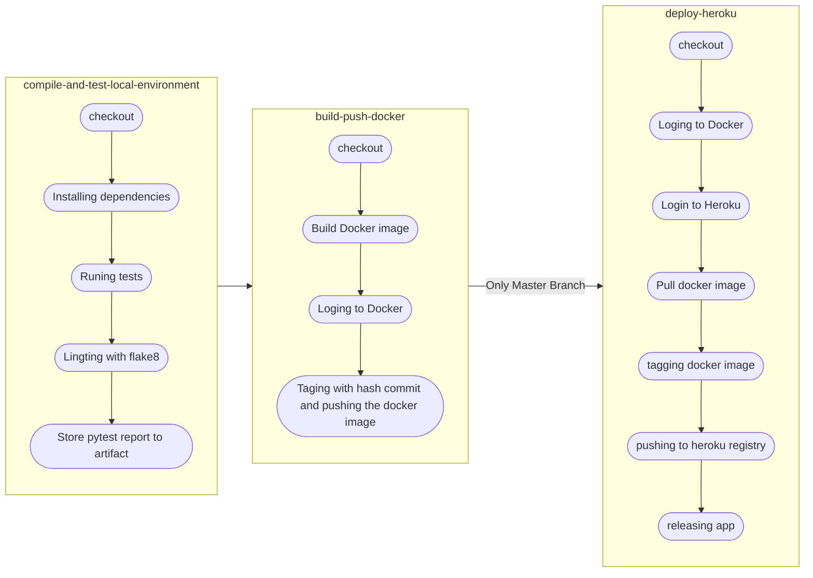

## Status

## Résumé

Site web d'Orange County Lettings

## Développement local

### Prérequis

- Compte GitHub avec accès en lecture à ce repository
- Git CLI
- SQLite3 CLI
- Interpréteur Python, version 3.6 ou supérieure

Dans le reste de la documentation sur le développement local, il est supposé que la commande `python` de votre OS shell exécute l'interpréteur Python ci-dessus (à moins qu'un environnement virtuel ne soit activé).

### macOS / Linux

#### Cloner le repository

- `cd /path/to/put/project/in`
- `git clone https://github.com/OpenClassrooms-Student-Center/Python-OC-Lettings-FR.git`

#### Créer l'environnement virtuel

- `cd /path/to/Python-OC-Lettings-FR`
- `python -m venv venv`
- `apt-get install python3-venv` (Si l'étape précédente comporte des erreurs avec un paquet non trouvé sur Ubuntu)
- Activer l'environnement `source venv/bin/activate`
- Confirmer que la commande `python` exécute l'interpréteur Python dans l'environnement virtuel
`which python`
- Confirmer que la version de l'interpréteur Python est la version 3.6 ou supérieure `python --version`
- Confirmer que la commande `pip` exécute l'exécutable pip dans l'environnement virtuel, `which pip`
- Pour désactiver l'environnement, `deactivate`

#### Exécuter le site

- `cd /path/to/Python-OC-Lettings-FR`
- `source venv/bin/activate`
- `pip install --requirement requirements.txt`
- `python manage.py runserver`
- Aller sur `http://localhost:8000` dans un navigateur.
- Confirmer que le site fonctionne et qu'il est possible de naviguer (vous devriez voir plusieurs profils et locations).

#### Linting

- `cd /path/to/Python-OC-Lettings-FR`
- `source venv/bin/activate`
- `flake8`

#### Tests unitaires

- `cd /path/to/Python-OC-Lettings-FR`
- `source venv/bin/activate`
- `pytest`

#### Base de données

- `cd /path/to/Python-OC-Lettings-FR`
- Ouvrir une session shell `sqlite3`
- Se connecter à la base de données `.open oc-lettings-site.sqlite3`
- Afficher les tables dans la base de données `.tables`
- Afficher les colonnes dans le tableau des profils, `pragma table_info(Python-OC-Lettings-FR_profile);`
- Lancer une requête sur la table des profils, `select user_id, favorite_city from
  Python-OC-Lettings-FR_profile where favorite_city like 'B%';`
- `.quit` pour quitter

#### Panel d'administration

- Aller sur `http://localhost:8000/admin`
- Connectez-vous avec l'utilisateur `admin`, mot de passe `Abc1234!`

### Windows

Utilisation de PowerShell, comme ci-dessus sauf :

- Pour activer l'environnement virtuel, `.\venv\Scripts\Activate.ps1`
- Remplacer `which <my-command>` par `(Get-Command <my-command>).Path`

## CI/CD - Intégration continue / Livraison continue

### Description du process CI/CD

Le pipeline a été mis en place via CircleCi. Il est constitué des étapes suivantes :

-   Compilation et test de l'environnement local
-   Création de l'image Docker, via le fichier Dockerfile, et téléchargement vers le dockerhub.
-   Déploiement sur heroku  à partir de l'image envoyée précédemment sur dockerhub.

> *Chaque étape doit être complétée avec succès pour passer à la suivante.*
> *La troisième étape à savoir le déploiement sur heroku n'est enclenché que les commit faits sur la branche **master***

Chacune de ces trois étapes est détaillées dans le graph ci-dessous.

### Configuration

### Github

Commencez par cloner le projet en local en suivant les étapes indiquées plus haut.

### Docker

#### Démarrer avec docker

 Commencer par créer un compte [docker](https://docker.com/) si ce n'est pas fait et [installer](https://docs.docker.com/get-docker/) le sur votre machine.

> [Documentation pour python](https://docs.docker.com/language/python/)

La configuration de la conteneurisation est située dans le fichier suivant `Dockerfile`  à la racine du projet.
Un fichier `.dockerignore` a été créé pour ne pas prendre en compte certains fichiers lors de la création de l'image.

Ce fichier est utilisé après l'étape de teste s'ils réussissent. Il permet de construire l'image, afin qu'elle soit par la suite envoyé sur dockerhub avec le tag du commit. Cette partie est gérée dans le fichier de configuration de CircleCi `.circleci/config.yml`.

L'adresse du dépôt docker hub est :  [https://hub.docker.com/r/deias/oc-lettings](https://hub.docker.com/r/deias/oc-lettings) .

Pour copier l'image en local vous pouvez taper: `docker pull deias/oc-lettings:<tag>`

!! Le tag doit être remplacé par version que vous souhaitez récupérer (voir [dockerhub](https://hub.docker.com/r/deias/oc-lettings/tags)).

#### Créer le Access Token

> [Documentation officielle sur la création du token](https://docs.docker.com/docker-hub/access-tokens/)

-   Se connecter au compte sur  [DockerHub](https://hub.docker.com/).
-   Aller dans  `Account Settings` puis à l'onglet  `Security`.
-   Cliquer sur  `New Access Token`.
-   Sélectionner  `Read, Write, Delete`.
-   Copier le token généré
-   Coller le token dans le champ de la variable d'environnement `DOCKER_HUB_ACCESS_TOKEN` sur CircleCI.

#### Démarrer l'application à partir de  l'image la plus récente stockée sur dockerhub

Taper cette commande dans l'interface de commande:

`docker run -d --name oc-lettings -e "PORT=8765" -e "DEBUG=1" -p 8000:8765 deias/oc-lettings:<tag>`

!! Remplacer `tag` par le tag de la version souhaitée ([liste des tags](https://hub.docker.com/r/deias/oc-lettings/tags)).

`oc-lettings`  sera le nom de notre container.

Vous pouvez vous connecter à l'application en allant sur l'adresse suivante: [http://127.0.0.1:8000](http://127.0.0.1:8000/).

`-d` permet de démarrer l'application en arrière plan.

Vous pouvez vérifier cela en tapant:  `docker ps`
Pour enlever les conteneurs en cours d'exécution :

    docker stop oc-lettings
    docker rm oc-lettings

#### Construire l'image Docker et lancer le site en local

Si vous travailler en local et que vous avez besoin de tester l'image sans passer par le pipline, à la racine du projet utilisez les commandes :

    docker build -t oc-lettings:dev .
    docker run -e "PORT=8765" -p 8000:8000 oc-lettings:dev

> dev est juste un tag que vous pouvez remplacez au besoin.
> -e "PORT=8765" permet de définir une variable d'environnement qui sera gérée par heroku lors de la phase de déploiement.

N'oubliez pas de supprimer le conteneur et l'image après utilisation pour gagner de l'espace:

    docker rm oc-lettings
    docker rmi -f oc-lettings

### CircleCI

La mise en place du pipline via CircleCI se fait de la mnière suivante:

 1. Créer un compte [CircleCi](https://circleci.com/).
 2. Lier votre compte GitHub hébergeant le projet au compte CircleCI.
 3. Choisir le projet dans l'onglet `Projects` puis cliquer sur `Set Up Project`.
 4. Sélectionner  `Fastest: Use the .circleci/config.yml in my repo` et choisir la branche `master`.

> `.circleci/config.yml`. est le chemin pour le fichier de configuration du pipline.

 5. Créer les variables d'environnements suivantes en allant sur le projet, `Project Settings` puis `Environment Variables`:

L'environnement CircleCI doit contenir les clés suivantes, à renseigner dans les paramètres du projet, sous l'onglet "Environment variables" :

 - DOCKER_HUB_ACCESS_TOKEN : Token créé à partir du compte dockerhub ([aide](https://docs.docker.com/docker-hub/access-tokens/))
 - DOCKER_HUB_USERNAME
 - DOCKER_REPO_NAME : le nom de la repository que vous voulez donner à votre image
 - HEROKU_API_KEY : ([aide](https://help.heroku.com/PBGP6IDE/how-should-i-generate-an-api-key-that-allows-me-to-use-the-heroku-platform-api))
 - HEROKU_APP_NAME : le nom de l'application heroku, dans mon cas `oc-letting`.
 - HEROKU_LOGIN: votre email de connexion à heroku